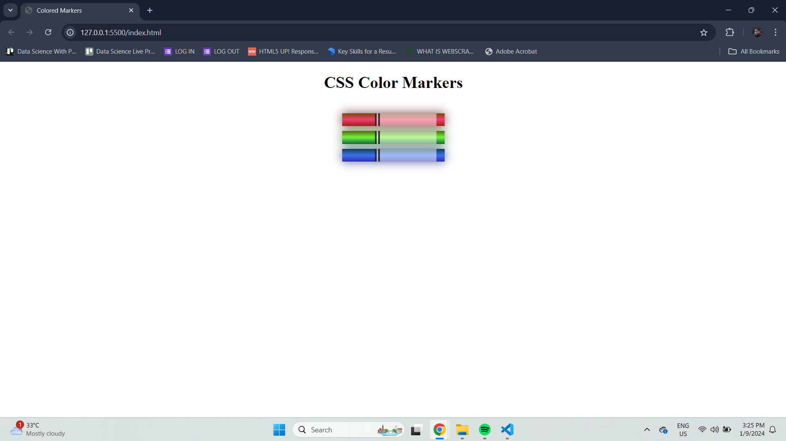

# CSS Color Markers

This project demonstrates the use of CSS to create visual representations of colored markers using HTML and CSS. The markers are styled with various CSS properties, including linear gradients and box shadows, to mimic the appearance of real markers.

## Preview



## Getting Started

To view this project, simply clone the repository and open the `index.html` file in your web browser.

### Prerequisites

You need a modern web browser that supports HTML5 and CSS3.

### Installation

1. Clone the repository:
   ```bash
   git clone https://github.com/ridhwanrosman1901/css-color-markers.git
   ```
2. Navigate to the project directory:
   ```bash
   cd css-color-markers
   ```
3. Open the `index.html` file in your web browser.

## Project Structure

- **index.html**: The main HTML file that contains the structure of the webpage.
- **styles.css**: The CSS file that styles the markers with different colors and effects.
- **preview.png**: A screenshot of the webpage to give an overview of the final output.

## CSS Techniques Used

- **Linear Gradients**: Used to create a gradient effect for each marker color.
- **Box Shadows**: Adds depth to the markers, giving them a realistic look.
- **RGBA and HSL Colors**: Different color models are used to demonstrate versatility in CSS color usage.
- **Flexbox**: For easy alignment and spacing of the markers.

## Contributing

Feel free to fork this repository and contribute with new features or improvements. Please submit a pull request with a description of your changes.

## License

This project is licensed under the MIT License. See the [LICENSE](LICENSE) file for details.

## Acknowledgments

- Inspiration for this project came from the need to practice CSS styling and learn more about different color models.